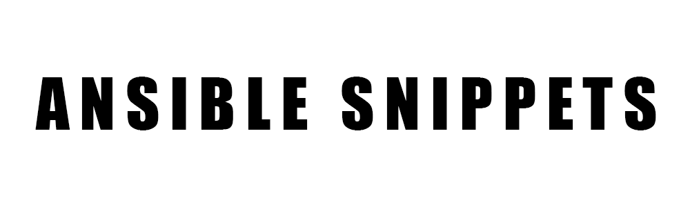

  

 
 
Ansible Snippets is a set of miscellaneous and unrelated ansible playbooks, built to try different configurations.

I wanted a place to test miscellaneous ansible playbooks.

**This is why I created this project**.

[Key Features](#key-features) •
[Installation](#installation) •
[Technologies Used](#technologies-used) •
[Contact Me](#contact-me) 

<!---->

## Key Features

- Miscellaneous and unrelated scripts.
- Testing and playing with different ideas.
- It can work with both on-prem and in the cloud (AWS, Azure, GCP...etc).

## Technologies Used

| Application                                         | Description                                  
| --------------------------------------------------- |--------------------------------------------- 
| [YAML](https://yaml.org/)                           | A Human-readable data-serialization language                 
| [Ansible](https://www.ansible.com/)                 | A software provisioning, configuration management, and application deployment tool                                  
| [Markdown Guide](https://www.markdownguide.org/)    | A reference guide that explains how to use markdown                                 

## Contact Me

